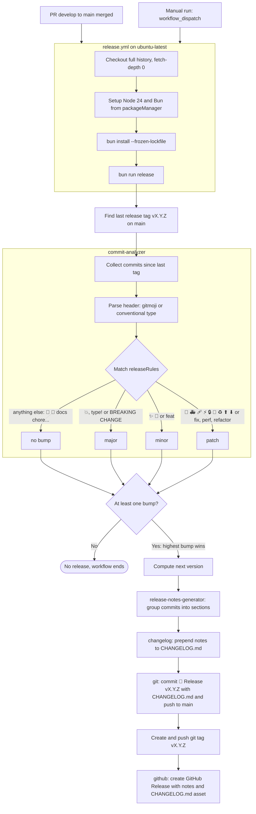

# Technical Guide

Detailed guide for technical implementation aspects.

## Tech Stack

| Category | Technology | Version |
|----------|------------|---------|
| Package Manager | Bun | 1.4.2 |
| Node | Node.js | ^22.14.0 \|\| >= 24.10.0 |
| Git Hooks | Husky | ^9.1.7 |
| Staged Files | lint-staged | ^17.5.1 |
| Commit Tool | gitmoji-cli | ^9.7.0 |
| Commit Lint | commitlint | ^21.2.2 |
| Release | semantic-release | ^25.0.9 |
| Markdown Lint | markdownlint-cli | ^0.49.1 |

---

## CI/CD

### Workflows

| Workflow | Trigger | Purpose |
|----------|---------|---------|
| `lint.yml` | Push / PR to `develop` and `main` | Markdown, YAML and commit message linting |
| `release.yml` | PR merged into `main`, manual | semantic-release (see [Semantic Release](#semantic-release)) |
| `init.yml` | First push of a repository created from the template | Template cleanup, `main` branch, labels (see [Repository Setup](#repository-setup)) |
| `setup.yml` | Manual | Apply `.github/settings.yml` with an `ADMIN_TOKEN` secret |

### Lint Workflow

The project runs linting on every push and PR to `develop` and `main`:

```yaml
# .github/workflows/lint.yml
name: Lint

on:
  push:
    branches: [develop, main]
  pull_request:
    branches: [develop, main]

jobs:
  markdownlint:
    runs-on: ubuntu-latest
    steps:
      - uses: actions/checkout@v7
      - uses: oven-sh/setup-bun@v2
        with:
          bun-version-file: package.json
      - run: bun install --frozen-lockfile
      - run: bun run lint:md

  yamllint:
    runs-on: ubuntu-latest
    steps:
      - uses: actions/checkout@v7
      - run: pip install yamllint
      - run: yamllint .
```

### Additional Workflows (Future)

- **PR Checks** - Tests, type checking
- **Security** - CodeQL analysis
- **Deploy** - Automated deployment

---

## Repository Setup

### Settings as Code

`.github/settings.yml` is the single source of truth for the GitHub
configuration (Settings app format):

| Section | Content |
|---------|---------|
| `repository` | Default branch `develop`, rebase-only merges, auto-merge, delete merged branches, vulnerability alerts on, Dependabot security updates off |
| `labels` | Type, priority, status and effort labels |
| `branches` | Protection of `develop` (PR + CI, no review) and `main` (PR + CI + 1 approval), linear history, no force push |

It is applied by `scripts/setup-github.js`, idempotent:

```bash
bun run setup:github                              # apply everything
bun run setup:github --dry-run                    # preview
bun run setup:github --only=labels,protection     # some sections only
```

Sections: `branches` (create missing `main` / `develop`), `repository`,
`security`, `labels`, `protection`. Authentication comes from `GH_TOKEN` /
`GITHUB_TOKEN` or the local `gh` session; `repository`, `security` and
`protection` need admin rights. Without local access, run the **Repository
Setup** workflow (`setup.yml`) after adding an `ADMIN_TOKEN` secret (PAT with
repository Administration read & write).

Settings GitHub cannot apply are reported as warnings, not errors: on GitHub
Free, private repositories have no branch protection and no auto-merge.

### New Repository Bootstrap

A repository created from the template only receives the template's default
branch (`develop`). On that first push, `init.yml` (with `GITHUB_TOKEN`):

1. Runs `scripts/init-template.js`: sets `package.json` name, version `0.0.0`
   and description, README title and links, `CONTRIBUTING.md` links, empties
   `CHANGELOG.md` and `docs/TASKS.md`, then deletes itself
2. Commits `🎉 Initialize project from template` on `develop`
3. Runs `setup-github.js --only=branches,labels`: creates `main` and the labels

The job is skipped in the template itself (`is_template`) and once
`scripts/init-template.js` is gone. `GITHUB_TOKEN` has no admin rights nor
`workflows` permission, hence the remaining manual step
`bun run setup:github`, and `init.yml` staying in place (safe to delete).

---

## Git Hooks

### Pre-commit Hook

Husky runs lint-staged automatically on commit:

```json
// package.json
{
  "lint-staged": {
    "*.md": "markdownlint --fix",
    "*.{yml,yaml}": "yamllint"
  }
}
```

### Commit-msg Hook

Commitlint validates commit messages:

```bash
# .husky/commit-msg
bun commitlint --edit "$1"
```

Configuration in `commitlint.config.js` accepts two formats:

- **Gitmoji**: `<emoji> <description>` (e.g., `✨ Add feature`)
- **Conventional**: `<type>(scope): <description>` (e.g., `feat: Add feature`)

Rules:

- Message must match one of the formats above
- Maximum header length of 100 characters

### Setup

Hooks are configured automatically via the `prepare` script:

```bash
bun install  # Runs "husky" automatically
```

---

## Dependency Management

Dependencies (Bun packages, `packageManager`, GitHub Actions, Node version in
workflows) are updated by [Renovate](https://docs.renovatebot.com/). The
[Renovate GitHub App](https://github.com/apps/renovate) must be installed on
the repository.

`renovate.json` extends the shared preset
[`maxime-lenne/renovate-config`](https://github.com/maxime-lenne/renovate-config)
and only holds project-specific rules:

| Behavior | Value |
|----------|-------|
| Schedule | Monday before 10am (Europe/Paris) |
| Commit / PR title | `⬆️ Update dependency <name> to <version>` |
| Minimum release age | 3 days before a PR is opened |
| Grouping | Non-major dev dependencies, non-major GitHub Actions |
| Automerge | Minor, patch, pin, digest, lock file maintenance (rebase) |
| Manual review | Major updates, minor updates of `0.x` runtime dependencies |
| Security | Fix PRs opened immediately from GitHub vulnerability alerts |

Automerge needs no human action: Renovate enables GitHub auto-merge
(`allow_auto_merge` in `.github/settings.yml`), or merges the PR itself once
all CI checks are green when auto-merge is not available. `main` is never
targeted: Renovate PRs go to `develop` (default branch) and reach `main`
through the regular release PR.

Project-specific rules in `renovate.json`:

- `conventional-changelog-conventionalcommits` is held below v10 (see
  [Semantic Release](#semantic-release))

Dependabot security updates are disabled (`enable_automated_security_fixes:
false`) to avoid duplicate PRs; GitHub vulnerability alerts stay enabled.

---

## Semantic Release

Automated versioning, release notes and `CHANGELOG.md` based on commit
messages. Configuration lives in `release.config.js`:

```bash
# Run release (usually done by CI)
bun run release

# Dry run to preview release
bun run release:dry
```

### Version Bumping and Release Notes

The commit header is parsed so that the leading gitmoji (unicode or
`:shortcode:`) or, without emoji, the conventional type becomes the commit
type. The same table drives the version bump and the release notes section:

| Gitmoji | Conventional | Version Bump | Release notes section |
|---------|--------------|--------------|-----------------------|
| 💥 | `type!:` | Major | 💥 Breaking Changes |
| ✨ 🎉 | `feat` | Minor | ✨ Features |
| 🐛 🚑️ 🩹 | `fix` | Patch | 🐛 Bug Fixes |
| 🔒️ | | Patch | 🔒 Security |
| ⚡️ | `perf` | Patch | ⚡ Performance |
| ♻️ | `refactor` | Patch | ♻️ Refactoring |
| 🚀 | | Patch | 🚀 Deployment |
| ⬆️ ⬇️ | | Patch | ⬆️ Dependencies |
| Others (📝 🔧 ✅ ...) | `docs`, `chore`, `ci`... | None | Not listed |

A `BREAKING CHANGE:` footer always triggers a major release. Hybrid commits
(`✨ feat(api): add endpoint`) are classified by their gitmoji.

### Release Process

Releases are automated via GitHub Actions (`.github/workflows/release.yml`):



What each release produces:

| Output | Produced by | Content |
|--------|-------------|---------|
| Version number | `@semantic-release/commit-analyzer` | Highest bump among commits since last tag |
| Release notes | `@semantic-release/release-notes-generator` | Commits grouped by section, see table above |
| `CHANGELOG.md` | `@semantic-release/changelog` | Release notes prepended to the file |
| Release commit | `@semantic-release/git` | `🔖 Release vX.Y.Z` pushed to `main` |
| Git tag | semantic-release core | `vX.Y.Z` on the release commit |
| GitHub Release | `@semantic-release/github` | Release notes + `CHANGELOG.md` attached |

`@semantic-release/npm` is not configured, so the `version` field of
`package.json` is not updated: the git tag is the source of truth.

`conventional-changelog-conventionalcommits` must stay on `^9`: v10 requires
`conventional-changelog-writer@9`, not yet used by
`@semantic-release/release-notes-generator@14`.

---

## Available Scripts

```bash
# Install dependencies
bun install

# Lint all files
bun run lint

# Lint markdown only
bun run lint:md

# Auto-fix markdown issues
bun run lint:md:fix

# Lint YAML files
bun run lint:yaml

# Create a commit with gitmoji
bun run commit

# Preview the next release
bun run release:dry

# Apply .github/settings.yml to GitHub
bun run setup:github

# Setup husky hooks (runs automatically on install)
bun run prepare
```

---

## Linting Rules

### Markdownlint

Configuration in `.markdownlint.json`:

- Line length limits
- Heading structure
- List formatting
- Code block rules

### Yamllint

Configuration in `.yamllint.yml`:

- Indentation rules
- Line length
- Key ordering

---

## Development Workflow

### Feature development

```bash
git checkout develop
git pull origin develop
git checkout -b feature/description

# ... make changes ...
bun run lint
bun run commit

# Before opening PR: rebase on latest develop
git fetch origin
git rebase origin/develop
git push origin feature/description
# → Open PR: feature/description → develop (rebase merge)
```

### Merge develop into main

```bash
# Once feature PRs are merged into develop:
git fetch origin
git checkout develop
git pull origin develop
# → Open PR: develop → main (rebase merge)
```

### Hotfix (urgent fix on main)

```bash
git checkout main
git pull origin main
git checkout -b hotfix/description

# ... fix ...
bun run commit
# → PR: hotfix/description → main (rebase merge)

# Re-sync develop after hotfix lands on main
git checkout develop
git fetch origin
git rebase origin/main          # ✅ never: git merge main
git push origin develop --force-with-lease
```

### Syncing develop when main advances

```bash
git checkout develop
git fetch origin
git rebase origin/main          # ✅ keeps linear history
git push origin develop --force-with-lease
# never: git merge main         # ❌ creates a merge commit → blocks rebase PR
```

### Pre-commit Checklist

- [ ] `bun run lint` passes
- [ ] Documentation updated if needed
- [ ] Commit uses gitmoji convention
- [ ] No sensitive data committed

---

## Issue Templates

### Bug Report

Uses `.github/ISSUE_TEMPLATE/bug_report.yml`:

- Description
- Steps to reproduce
- Expected vs actual behavior
- Environment details

### Feature Request

Uses `.github/ISSUE_TEMPLATE/feature_request.yml`:

- Problem description
- Proposed solution
- Alternatives considered

---

*Last updated: 2026-09-18*
